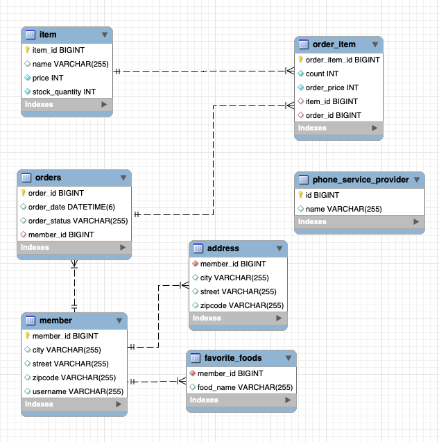

# 참고 자료
- 인프런 김영한 JPA 강의보면서 직접 해본거

# erd

# 새로 알게된 JPA 기능

### Dynamic Update
- [spring jpa dynamic update | Baeldung](https://www.baeldung.com/spring-data-jpa-dynamicupdate)
- @DynamicUpdate는 JPA 엔티티의 클래스 레벨에 적용될 수 있다고 함.
  
  Hibernate가 변경된 컬럼에 대해서만 SQL을 만들도록 해주는 기능이라고 함.

  근데 @DynamicUpdate를 쓰면 cache된 SQL문을 사용하지 않고, 엔티티가 수정될 때 마다 매번 새로 변경된 컬럼에 대해서만 SQL문을 만든다고 함.

  또 변경된 컬럼이 무엇인지 추적해야 하니까 성능 오버헤드가 있다고 함.

  